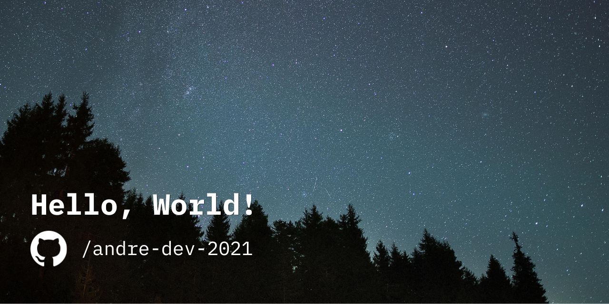

# 👨‍🚀 Olá Mundo! Eu sou André Pereira.

- 🎓 Sou estudante de **Sistemas de Informação** na UNASP.
- 🔍 Gosto de experimentar novas linguagens e ferramentas, e de me manter atualizado sobre o que acontece no mundo da tecnologia.
- 🎯 Estou em busca de me tornar um **Desenvolvedor Backend**.

## 🛠️ Algumas linguagens e ferramentas que já utilizei

**Linguagens que mais utilizo**:

**Bibliotecas e frameworks que mais utilizo**:

**Bancos de dados**:

**O essencial que não pode faltar**:

**Outras ferramentas**:

**Também já utilizei**:

## 🚀 Principais projetos
<table>
  <tr>
    <td width="50%">
      <h3>Desafio Backend Itaú Unibanco (adaptado)</h3>
      
Adaptação para NestJS de um desafio backend comum para SpringBoot, consistindo de uma API REST para registro e estatística de transações financeiras.

      
<strong>Stack:</strong> NestJS, Node.js, Jest

      <a href="https://github.com/andre-dev-2021/desafio-itau-backend">Acessar o repositório →</a>
    </td>
    <td width="50%">
      <h3>Chatbot Telegram para previsão do tempo</h3>
      
Projeto de integração entre APIs Telegram e OpenWeather utilizando Python.

      
<strong>Stack:</strong> Python

      <a href="https://github.com/andre-dev-2021/projeto-bot-python">Acessar o repositório →</a>
    </td>
  </tr>
</table>

## Pode falar comigo!

Fico feliz em trocar uma ideia ou receber sugestões — sinta-se à vontade para chamar!

